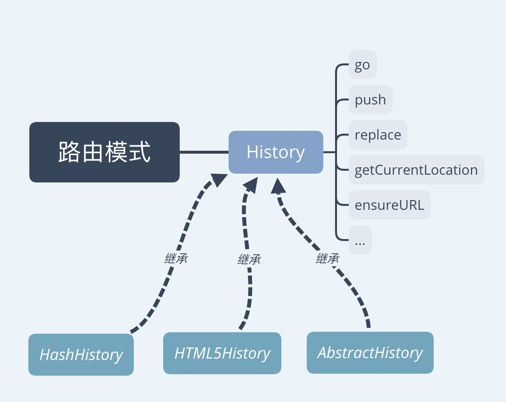

# 路由模式及降级处理

`vue-router` 默认是 `hash` 模式 ， 即使用 `URL` 的 `hash` 来模拟一个完整的 `URL` ，于是当 `URL` 改变时，页面不会重新加载。

`vue-router` 还支持 `history` 模式，这种模式充分利用了 `history.pushState` 来完成 `URL` 跳转。

在不支持 `history.pushState` 的浏览器 ， 会自动会退到 `hash` 模式。

:::tip
是否回退可以通过 `fallback` 配置项来控制，默认值为 true
:::

```javascript
const router = new VueRouter({
  mode: 'history', // history 或 hash
  routes: [...]
});
```

详细使用可参看文档： [HTML5 History 模式](https://router.vuejs.org/zh/guide/essentials/history-mode.html)

## 根据 mode 确定类型

首先看下 VueRouter 的构造方法 ， 文件位置 `src/index.js`

```javascript
import { HashHistory } from './history/hash'
import { HTML5History } from './history/html5'
import { AbstractHistory } from './history/abstract'

    // ... more

    constructor(options: RouterOptions = {}) {
        // ... more

        // 默认hash模式
        let mode = options.mode || 'hash'

        // 是否降级处理
        this.fallback = mode === 'history' && !supportsPushState && options.fallback !== false

        // 进行降级处理
        if (this.fallback) {
            mode = 'hash'
        }

        if (!inBrowser) {
            mode = 'abstract'
        }
        this.mode = mode

        // 根据不同的mode进行不同的处理
        switch (mode) {
            case 'history':
                this.history = new HTML5History(this, options.base)
                break
            case 'hash':
                this.history = new HashHistory(this, options.base, this.fallback)
                break
            case 'abstract':
                this.history = new AbstractHistory(this, options.base)
                break
            default:
                if (process.env.NODE_ENV !== 'production') {
                    assert(false, `invalid mode: ${mode}`)
                }
        }
    }
```

我们可以看到，会判断是否支持 `history` ， 然后根据 `fallback` 来确定是否要降级。然后，根据不同的 `mode` ， 分别实例化不同的 `history` 。 （`HTML5History、HashHistory、AbstractHistory`）

## history

我们看到 ， `HTML5History、HashHistory、AbstractHistory`都是来自 history 目录。

```javascript
├── history  // 操作浏览器记录的一系列内容
│   ├── abstract.js  // 非浏览器的history
│   ├── base.js    // 基本的history
│   ├── hash.js    // hash模式的history
│   └── html5.js   // html5模式的history
```

其中， base.js 里面定义了 History 类

基本的关系如下图：


`base.js` 里面定义了一些列的方法， `hash` `、html5` 模式，分别继承了这些方法，并实现了自己特有的逻辑

从外部调用的时候，会直接调用到 `this.history` , 然后，由于初始化对象的不同，而进行不同的操作。

接下来， 我们挑选其中一个我们最常用到的 `push` 方法来解释一整个过程

### push 方法

我们平时调用的时候， 一直都是用 `this.$router.push('home')` , 这种形式调用。

首先，在 `VueRouter` 对象上有一个 push 方法 。

```javascript
// 文件位置： src/index.js
export default class VueRouter {
    // ... more

    push(location: RawLocation, onComplete?: Function, onAbort?: Function) {
        this.history.push(location, onComplete, onAbort);
    }
}
```

我们看到，其没有做任何处理，直接转发到 `this.history.push(location, onComplete, onAbort)`。

上面我们讲到，这个处理，会根据 history 的初始化对象不同而做不同处理。我们来分别看看细节

#### mode === hash

```javascript
export class HashHistory extends History {
    // ...more

    // 跳转到
    push(location: RawLocation, onComplete?: Function, onAbort?: Function) {
        const { current: fromRoute } = this;
        this.transitionTo(
            location,
            route => {
                pushHash(route.fullPath);
                handleScroll(this.router, route, fromRoute, false);
                onComplete && onComplete(route);
            },
            onAbort
        );
    }
}

// 切换路由
// 会判断是否支持pushState ，支持则使用pushState，否则切换hash
function pushHash(path) {
    if (supportsPushState) {
        pushState(getUrl(path));
    } else {
        window.location.hash = path;
    }
}
```

#### mode === history

```javascript
export class HTML5History extends History {
    // ...more

    // 增加 hash
    push(location: RawLocation, onComplete?: Function, onAbort?: Function) {
        const { current: fromRoute } = this;
        this.transitionTo(
            location,
            route => {
                pushState(cleanPath(this.base + route.fullPath));
                handleScroll(this.router, route, fromRoute, false);
                onComplete && onComplete(route);
            },
            onAbort
        );
    }
}
```

两种模式的 `push` 实现区别并不大，都是调用了 `transitionTo` , 区别在于： 一个调用 `pushHash` ， 一个调用 `pushState`.

其他的 `go` 、 `replace` `、getCurrentLocation` 都是类似的实现方式。

:::tip
`transitionTo`的具体实现，这里就先不详聊了，后面聊到路由守护的时候，会细讲这一块内容。
:::

