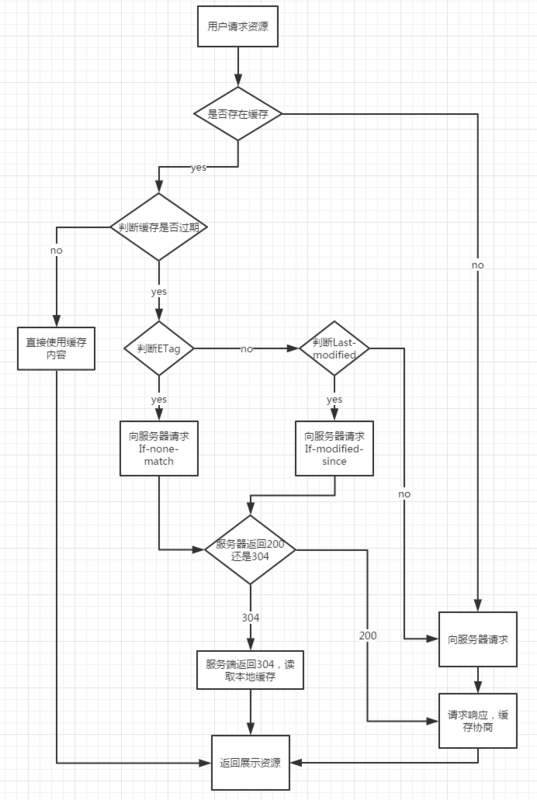

# 缓存

1. 减少相应延迟：因为请求从缓存服务器（离客户端更近）而不是源服务器被相应，这个过程耗时更少，让 web 服务器看上去相应更快。

2. 减少网络带宽消耗：当副本被重用时会减低客户端的带宽消耗；客户可以节省带宽费用，控制带宽的需求的增长并更易于管理。

## 缓存几种状态码

200，304 ， 200（from cache）

## 如何关闭缓存

Cache-Control: no-cache

## 缓存机制，如何判断使用缓存

1. Cache-Control max-age 、Expires ---> 200 ，两个同时存在已 max-age 为准

> 因为 Expires 返回的是服务器时间，在浏览器如果时间相差很大会有问题，所以 http1.1 才出了 Cache-control：max-age

2. Last-Modified , ETag --> If-Modified-Since,f-None-Match ---> 304

## 如何更新缓存：

1. 针对用户：通过修改版本号。
2. 开发：禁用浏览器缓存

## 部署的问题

#### 覆盖式

公司的发布方式：登陆后台发布系统，将文件同步到线上

##### 问题：先发布页面还是先发布静态资源，各自存在的问题

-   先部署页面，再部署资源：在二者部署的时间间隔内，如果有用户访问页面，就会在新的页面结构中加载旧的资源，并且把这个旧版本的资源当做新版本缓存起来，其结果就是：用户访问到了一个样式错乱的页面，除非手动刷新，否则在资源缓存过期之前，页面会一直执行错误。
-   先部署资源，再部署页面：在部署时间间隔之内，有旧版本资源本地缓存的用户访问网站，由于请求的页面是旧版本的，资源引用没有改变，浏览器将直接使用本地缓存，这种情况下页面展现正常；但没有本地缓存或者缓存过期的用户访问网站，就会出现旧版本页面加载新版本资源的情况，导致页面执行错误，但当页面完成部署，这部分用户再次访问页面又会恢复正常了。

##### 目前公司的发布方式（建议）：

1. 将静态资源文件发布上去，替换掉老版本
2. 修改页面中文件版本号
3. 发布页面

#### 非覆盖式

用文件的摘要信息来对资源文件进行重命名，把摘要信息放到资源文件发布路径中，这样，内容有修改的资源就变成了一个新的文件发布到线上，不会覆盖已有的资源文件。上线过程中，先全量部署静态资源，再灰度部署页面，整个问题就比较完美的解决了
