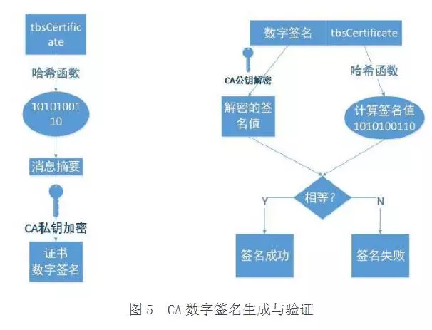

# http 与 https

## http 协议

http 是一个基于 TCP/IP 通信协议来传递数据（HTML 文件, 图片文件, 查询结果等）

http 协议是无状态的，同一个客户端的这次请求和上次请求是没有对应关系，对 http 服务器来说，它并不知道这两个请求来自同一个客户端。 为了解决这个问题， Web 程序引入了 Cookie 机制来维护状态.

### 统一资源标识符 （URI）

HTTP 使用统一资源标识符（Uniform Resource Identifiers, URI）来传输数据和建立连接

-   `http://<host>:<port>/<path>?<query>#<frag>`

-   `https://<host>:<port>/<path>?<query>#<frag>`

-   默认 HTTP 的端口号为 80，HTTPS 的端口号为 443。

### HTTP 报文结构（请求报文和响应报文）

1. request line 请求行
2. request header 请求头
3. 空行
4. body 内容: 请求数据

#### 请求行

> GET /index.js HTTP/1.1

请求方法：

1. GET 获取
2. POST 对资源的建立或修改、
3. HEAD ：类似 get，只不过响应只有报头，用于节省字节
4. PUT ： 替换对应的资源
5. DELETE 删除
6. OPTIONS 嗅探请求预检，复杂请求中跨域的时候用到

#### 请求头

-   host 域名
-   User-Agent : 它是一个特殊字符串头，使得服务器能够识别客户使用的操作系统及版本、CPU 类型、浏览器及版本、浏览器渲染引擎、浏览器语言、浏览器插件等。
-   Referer 告诉服务器我是从哪个页面链接过来的，服务器基于此可以获得一些信息用于处理
-   Accept-Encoding 浏览器发给服务器,声明浏览器支持的编码类型 eg: gzip(一般对纯文本内容可压缩到原大小的 40%)
-   cookie 保存一些信息
-   If-Modified-Since 从何时开始是否有修改
-   If-None-Match 检查 MD5 之类的 hash 值
-   Cache-Control: no-cache

#### 响应头

-   Content-Type 响应的 HTTP 内容类型
-   Cache-Control max-age=3600
-   Expires 过期时间
-   Access-Control-Allow-Origin 设置允许的来源，验证请求的时候会带的 Origin
-   Access-Control-Allow-Headers 设置允许跨域携带的 headers
-   Access-Control-Allow-Methods 设置允许跨域方法
-   ETag 被请求变量的实体值,与 Web 资源关联的记号
-   last-modified 标记此文件在服务器端最后被修改的时间
-   status 状态码
-   Set-Cookie 设置客户端的 cookie

### 状态码

##### 1xx 消息

##### 2xx 请求成功

-   200 成功
-   206 （Partial Content）断点续传和多线程下载

##### 3xx 重定向

-   301 请求的资源永久从不同的 URI 响应请求
-   302 请求的资源临时从不同的 URI 响应请求
-   304 如果客户端发送了一个带条件的 GET 请求且该请求已被允许，而文档的内容（自上次访问以来或者根据请求的条件）并没有改变，则服务器应当返回这个状态码

##### 4xx 客户端错误

-   400 Bad Request （语义有误或者请求参数出错）
-   401 Unauthorized 需要权限验证
-   403 Forbidden 服务器收到请求，但是拒绝提供服务
-   404 not found 请求失败，请求所希望得到的资源未被在服务器上发现

##### 5xx 服务器错误

-   500 Internal Server Error 服务器遇到了一个未曾预料的状况，导致了它无法完成对请求的处理
-   503 Service Unavailable 由于临时的服务器维护或者过载，服务器当前无法处理请求
-   504 Bad Gateway 作为网关或者代理工作的服务器尝试执行请求时，未能及时从上游服务器或者辅助服务器（例如 DNS）收到响应。

## https

> HTTPS = HTTP + SSL

### 加密方式

对称加密，比较有代表性的就是 AES 加密算法；双方密钥相同，加解密速度快

非对称加密，经常使用到的 RSA 加密算法就是非对称加密的；公钥和私钥

### http 风险

1. 被窃听
2. 被篡改
3. 被冒充

### 基本运行原理

1. 客户端和服务端建立 SSL 握手 _客户端通过 CA 证书来确认服务端的身份_；
2. 互相传递三个随机数，之后通过这随机数来生成一个密钥；
3. 互相确认密钥，然后握手结束；
4. 数据通讯开始，都使用同一个对话密钥来加解密；

#### 基本运行原理（详细）

1. 首先，客户端 A 访问服务器 B ，客户端 A 会生成一个随机数 1，把随机数 1 、自己支持的 SSL 版本号以及加密算法等这些信息告诉服务器 B 。
2. 服务器 B 知道这些信息后，确认一下双方的加密算法，生成一个随机数 2 以及一个**公钥**返回给客户端 A
3. 客户端 A 生成一个随机数 3 ，然后用公钥加密随机数 3 并传输给服务端 B 。
4. 服务端 B 接收到后利用私钥进行解密，得到随机数 3。
5. 最后，客户端 A 和服务端 B 都有随机数 1、随机数 2、随机数 3，然后双方都利用这三个随机数生成一个对话密钥。之后传输内容就是利用对话密钥来进行加解密了。这时就是利用了对称加密。
6. SSL 的握手部分结束，客户端 A 和服务器 B 开始使用相同的对话密钥进行数据通讯。

### 为啥需要 CA 证书

因为在第一步的时候，我们并不清楚服务器 B 是不是真的是服务器 B。所以需要一个我们信得过的机构来告诉我们。

#### 基本运行原理（带 CA 证书）

1. 首先，客户端 A 访问服务器 B ，客户端 A 会生成一个随机数 1，把随机数 1 、自己支持的 SSL 版本号以及加密算法等这些信息告诉服务器 B 。
2. 服务器 B 知道这些信息后，确认一下双方的加密算法，然后也生成一个随机数 B ，并将随机数 B 和 **CA 颁发给自己的证书一同返回给客户端 A** 。
3. **客户端 A 得到 CA 证书后，会去校验该 CA 证书的有效性。校验通过后**，客户端生成一个随机数 3 ，然后用证书中的公钥加密随机数 3 并传输给服务端 B 。
4. 服务端 B 加密后的随机数 3，利用私钥进行解密，得到随机数 3。
5. 最后，客户端 A 和服务端 B 都有随机数 1、随机数 2、随机数 3，然后双方都利用这三个随机数生成一个对话密钥。之后传输内容就是利用对话密钥来进行加解密了。这时就是利用了对称加密，一般用的都是 AES 算法。
6. SSL 的握手部分结束，客户端 A 和服务器 B 开始使用相同的对话密钥进行数据通讯。

### 浏览器验证证书的合法性

### 证书链

证书链由多个证书一层一层组成的，除了最底层的网站证书的公钥是给用户加密报文外，其他层证书中的公钥均用于解密底层的证书指纹签名。最高层的根证书是**自签名**的，也就是自己颁发给自己，所以它的公钥不仅用来解密下层的签名，也用来给自己的签名解密。
